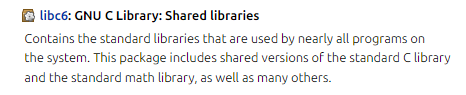
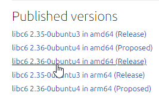

# how to build

```bash
cargo build
```

binary is in `target/debug/`

# added feature

Fetch libc and ld by specifing version string (for example `2.36-0ubuntu4_amd64`), and unstrip libc. The result libc is unstripped using package `libc6-dbg_` and ready for debug (I forgot to reserve the source code).

```bash
$ ../target/debug/pwninit -h
[...]
OPTIONS:
        --bin <bin>                                  Binary to pwn
    -f, --fetch <fetch>                              Fetch libc and ld by version
[...]

$ pwninit -f 2.36-0ubuntu4_amd64
fetching libc and linker version: 2.36-0ubuntu4_amd64
https://launchpad.net/ubuntu/+archive/primary/+files//libc6_2.36-0ubuntu4_amd64.deb
https://launchpad.net/ubuntu/+archive/primary/+files//libc6_2.36-0ubuntu4_amd64.deb
libc: ./libc-2.36.so
ld: ./ld-2.36.so

warning: failed setting binary to be executable: binary not found
unstripping libc
https://launchpad.net/ubuntu/+archive/primary/+files//libc6-dbg_2.36-0ubuntu4_amd64.deb
setting ./ld-2.36.so executable
$ ls
ld-2.36.so  libc-2.36.so  solve.py
$ file *
ld-2.36.so:   ELF 64-bit LSB shared object, x86-64, version 1 (GNU/Linux), dynamically linked, BuildID[sha1]=292e105c0bb3ee8e8f5b917f8af764373d206659, stripped
libc-2.36.so: ELF 64-bit LSB shared object, x86-64, version 1 (GNU/Linux), dynamically linked, interpreter /lib64/ld-linux-x86-64.so.2, BuildID[sha1]=d1704d25fbbb72fa95d517b883131828c0883fe9, for GNU/Linux 3.2.0, with debug_info, not stripped
solve.py:     Python script, ASCII text executable, with CRLF line terminators
$
```

How to get the string? In the above example, I google "glibc 2.36 source package", go to the site "launchpad.net", then find the `libc6` entry: 



Now you can see the string:


